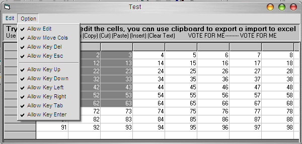



## Full Control Grid

### Description

It is a class that implement copy, paste, cut, insert, clear cells, clear all,... and coming soon undo, redo, and autocomplete...Just Try it, Sorry by my english ***Vote for me***
 
### More Info
 

             |
---                |---
**Submitted On**   |2004-11-04 06:17:32
**By**             |[Jaime Abad](https://github.com/Planet-Source-Code/PSCIndex/blob/master/ByAuthor/jaime-abad.md)
**Level**          |Beginner
**User Rating**    |4.8 (43 globes from 9 users)
**Compatibility**  |VB 6\.0
**Category**       |[Miscellaneous](https://github.com/Planet-Source-Code/PSCIndex/blob/master/ByCategory/miscellaneous__1-1.md)
**World**          |[Visual Basic](https://github.com/Planet-Source-Code/PSCIndex/blob/master/ByWorld/visual-basic.md)
**Archive File**   |[Full\_Contr1814421142004\.zip](https://github.com/Planet-Source-Code/jaime-abad-full-control-grid__1-57085/archive/master.zip)

